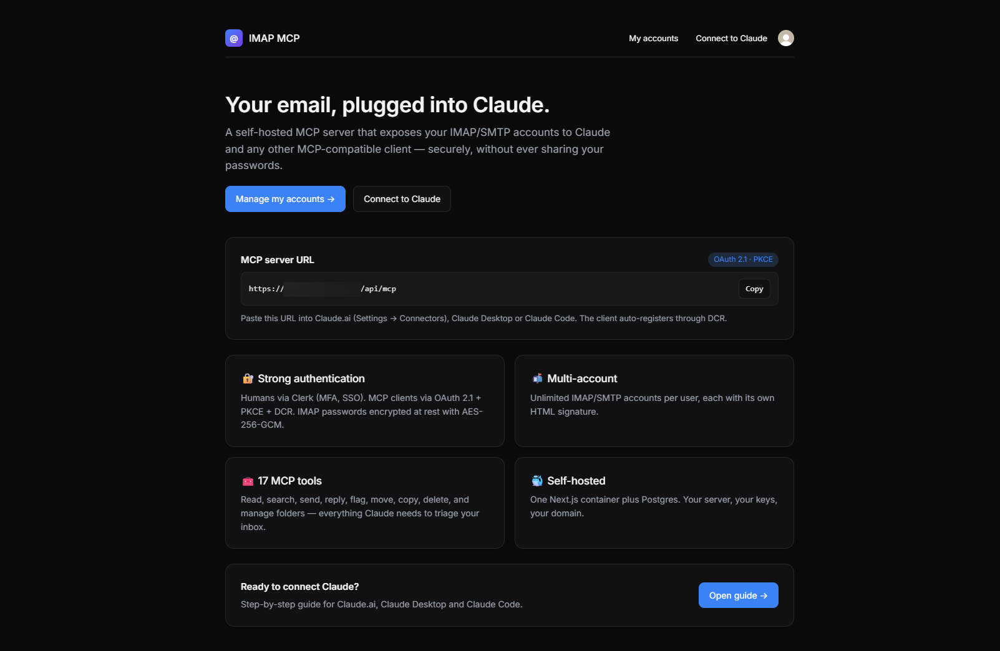

# imap-mcp

> Self-hosted remote **MCP server** that lets an AI (Claude, etc.) read, search and send email through **multiple IMAP/SMTP accounts**, and read/write the user's calendar through **CalDAV** — authenticated via **Clerk**.

[](LICENSE)
[](https://nextjs.org)
[](https://www.typescriptlang.org/)
[](https://modelcontextprotocol.io)



---

## Why

MCP clients (Claude Desktop, Claude.ai, …) can talk to remote servers, but none of them ship with a way to plug **your own** IMAP/SMTP and CalDAV accounts securely. Shoving raw credentials into a client config or shipping them to a third-party SaaS is a non-starter for anything serious.

`imap-mcp` is a tiny, self-hosted Next.js app that:

- authenticates **humans** with Clerk (you get a real sign-in UI, MFA, SSO, whatever Clerk supports),
- authenticates **MCP clients** with OAuth 2.1 (PKCE + Dynamic Client Registration),
- stores an **arbitrary number of IMAP/SMTP and CalDAV accounts** per user, encrypted at rest (AES-256-GCM),
- exposes those accounts to any MCP client through a clean set of tools — emails *and* calendar.

One container, one domain, your server, your keys.

## Features

- 🔐 **Clerk** for user auth — you manage users, not us
- 🔑 **OAuth 2.1** (Authorization Code + PKCE) with **Dynamic Client Registration** (RFC 7591)
- 📬 Unlimited IMAP/SMTP accounts per user, each with its own **HTML signature** (Tiptap editor, DOMPurify-sanitized)
- 🗓️ Unlimited **CalDAV calendar accounts** per user — list/read/create/update/delete events and find free slots, fully timezone-aware (TZID + DST-correct recurrences)
- 🔒 Credentials encrypted with **AES-256-GCM**; OAuth tokens stored as **SHA-256** hashes only
- 🧰 **27 MCP tools**: 19 email tools (list/read/search/send/reply/flag/move/folder ops) + 8 calendar tools (`list_calendar_accounts`, `list_calendars`, `list_events`, `get_event`, `create_event`, `update_event`, `delete_event`, `find_free_slots`)
- 🧪 **Test connection from the list** (IMAP `NOOP` + SMTP `VERIFY`, CalDAV principal-discovery) with per-account status badges and actionable error hints
- ⚡ **Provider presets** on account creation: Gmail, Outlook / Microsoft 365, iCloud, Yahoo, Fastmail, OVH for email — iCloud, Fastmail, Nextcloud, OVH, Baïkal/generic for calendars
- ⚠️ **Live port/SSL consistency warnings** — catches the `wrong version number` trap before it happens
- 🎯 **`/connect` guide** with tabbed, copy-to-clipboard setup instructions for **Claude.ai** (web), **Claude Desktop** and **Claude Code**
- 🎨 Polished UI: light/dark, hero homepage, status badges, shadows, focus rings
- 🐳 Ships as a 2-service `docker-compose` (Postgres + app)

## Architecture

```
┌─────────────────┐   OAuth 2.1 (PKCE + DCR)   ┌──────────────────────────┐
│   MCP client    │ ◀────────────────────────▶ │  /api/oauth/*            │
│ (Claude, …)     │   Bearer-auth'd JSON-RPC   │  /api/mcp   ← tools      │
└─────────────────┘                            │                          │
                                               │   Next.js 15 (App Router)│
┌─────────────────┐   Clerk session            │   /accounts  ← web UI    │
│     Browser     │ ─────────────────────────▶ │                          │
└─────────────────┘                            └──────────────┬───────────┘
                                                              │ Drizzle
                                                        ┌─────▼─────┐
                                                        │ Postgres  │
                                                        └───────────┘
```

The Next.js app is simultaneously:

- the **OAuth Authorization Server** (issues codes and tokens),
- the **OAuth Resource Server** (validates Bearer tokens at `/api/mcp`),
- the **web UI** for users to manage their accounts.

Human auth at the `/authorize` endpoint is delegated to the active Clerk session.

## Stack

| Concern      | Choice                                                  |
| -------------- | ------------------------------------------------------- |
| Framework      | Next.js 15 (App Router), React 19                       |
| Language       | TypeScript (strict)                                     |
| Human auth     | [`@clerk/nextjs`](https://clerk.com)                    |
| Database       | PostgreSQL 16                                           |
| ORM            | [`drizzle-orm`](https://orm.drizzle.team)               |
| IMAP client    | [`imapflow`](https://github.com/postalsys/imapflow)     |
| SMTP client    | [`nodemailer`](https://nodemailer.com)                  |
| CalDAV client  | [`tsdav`](https://github.com/natelindev/tsdav)          |
| iCalendar      | [`ical.js`](https://github.com/kewisch/ical.js) (Mozilla) |
| MCP SDK        | [`@modelcontextprotocol/sdk`](https://github.com/modelcontextprotocol/typescript-sdk) |
| HTML editor    | [Tiptap](https://tiptap.dev)                            |
| Sanitizer      | [`isomorphic-dompurify`](https://github.com/kkomelin/isomorphic-dompurify) |
| Transport      | **Streamable HTTP** (MCP spec 2025-06-18)               |

## Getting started

### 1. Clone & configure

```bash
git clone <your-fork> imap-mcp
cd imap-mcp
cp .env.example .env
```

Fill in `.env`:

```bash
# Generate a fresh 32-byte master key
openssl rand -base64 32
```

Paste it as `MCP_MASTER_KEY`. Add your Clerk keys (`pk_test_…` / `sk_test_…`) and set `NEXT_PUBLIC_APP_URL` to the public URL of your deployment (e.g. `https://mcp.example.com` or `http://localhost:3000` for local).

⚠️ **Losing `MCP_MASTER_KEY` means losing every stored IMAP/SMTP password.** Back it up.

### 2. Run with Docker

```bash
docker compose up --build
# In another terminal, apply the schema on first install:
docker compose exec app npx drizzle-kit push
```

App is now available at `http://localhost:3000`.

### 3. Add an email account

1. Open the app, sign up with Clerk.
2. Go to **`/accounts/new`**.
3. Pick a **provider preset** (Gmail, Outlook, iCloud, Yahoo, Fastmail, OVH) to auto-fill hosts, ports and SSL flags — or fill them by hand.
4. Gmail / Google Workspace: use an **app password** (`https://myaccount.google.com/apppasswords`).
5. Optionally paste/edit an HTML signature.
6. Save, then click **Test** on the account card. Both IMAP and SMTP must come back green.

### 3b. Add a calendar account (optional)

1. Go to **`/calendars/new`**.
2. Pick a preset (iCloud, Fastmail, Nextcloud, OVH, Baïkal/generic) to fill the CalDAV base URL — `tsdav` auto-discovers the principal and home calendars from there.
3. Use a provider **app password** (Apple, Fastmail, Nextcloud all expose one). Google Calendar **is not supported in v1** because Google requires OAuth 2.0 for CalDAV — see *Out of scope* below.
4. Save, then click **Test connection**: the badge shows the number of calendars discovered.

### 4. Connect your MCP client

Every signed-in user has a built-in guide at **`/connect`** with tabbed setup instructions
and copy-to-clipboard snippets for the three major Claude surfaces:

#### Claude.ai (web)

1. Open **Settings → Connectors → Add custom connector**.
2. Paste `https://<your-domain>/api/mcp`.
3. Sign in with Clerk in the popup, approve.

#### Claude Desktop

Merge into `~/Library/Application Support/Claude/claude_desktop_config.json`
(or the equivalent on Windows/Linux):

```json
{
  "mcpServers": {
    "email-mcp": {
      "command": "npx",
      "args": ["-y", "mcp-remote", "https://<your-domain>/api/mcp"]
    }
  }
}
```

Restart the app; the OAuth browser flow launches on first use. Requires Node ≥ 18.

#### Claude Code

```bash
claude mcp add --transport http email-mcp https://<your-domain>/api/mcp
```

Then type `/mcp` in a session — the first tool call triggers OAuth.

#### Under the hood

The client will:

1. `GET /.well-known/oauth-protected-resource` — discover the auth server,
2. `POST /api/oauth/register` — auto-register itself,
3. open `/api/oauth/authorize` in a browser — you sign in with Clerk and approve,
4. `POST /api/oauth/token` — exchange the code for an access token,
5. call `/api/mcp` with `Authorization: Bearer …`.

All of this is handled transparently by conformant MCP clients.

## Troubleshooting

### SMTP test fails with `tls_validate_record_header:wrong version number`

Port/SSL mismatch. The form now warns about this live, and the accounts list surfaces a
hint when the test fails. Use one of:

| Port | SSL/TLS checkbox | Meaning              |
| ---- | ---------------- | -------------------- |
| 465  | ✅ on            | Implicit TLS         |
| 587  | ❌ off           | STARTTLS upgrade     |
| 25   | ❌ off           | Plain (discouraged)  |

### First Docker build fails on `DATABASE_URL is not set`

The builder needs a placeholder at build-time; this repo's `Dockerfile` already sets a
dummy `DATABASE_URL` and `MCP_MASTER_KEY` for the build stage, and receives
`NEXT_PUBLIC_CLERK_PUBLISHABLE_KEY` / `NEXT_PUBLIC_APP_URL` as build args from
`docker-compose.yml`. Make sure your `.env` defines them before `docker compose up --build`.

### Applying the schema inside Docker

```bash
docker compose exec app node node_modules/drizzle-kit/bin.cjs push
```

(The `drizzle-kit push` command needs `esbuild` at runtime to load the TS config. If
missing, install it in the container: `docker compose exec app npm i esbuild --no-save`.)

## MCP tools

### Reading & searching

| Tool              | Purpose                                                                 |
| ----------------- | ----------------------------------------------------------------------- |
| `list_accounts`   | List the current user's configured accounts                             |
| `list_folders`    | IMAP `LIST` — all mailboxes for a given account                         |
| `list_messages`   | Headers of the N most recent messages in a folder (with filters)        |
| `get_message`     | Full message: headers, text, HTML, attachments metadata (with indexes)  |
| `get_thread`      | Full conversation around a message; Gmail X-GM-THRID fast-path + RFC 5322 References fallback. `cross_folder=true` scans every mailbox. |
| `search_messages` | IMAP `SEARCH` by `from`, `to`, `subject`, `body`, date ranges, unread   |
| `get_attachment`  | Return a signed 15-minute HTTPS download URL for an attachment (file never persisted on the MCP server). Images are also previewed inline. `inline_blob=true` opts into returning the raw base64 as an embedded MCP resource. |

### Sending

| Tool              | Purpose                                                                 |
| ----------------- | ----------------------------------------------------------------------- |
| `send_message`    | Send via the account's SMTP, appending the HTML signature and base64 attachments; the sent copy is IMAP-appended to the Sent folder (skipped on Gmail, which saves it automatically). |
| `reply_message`   | Reply preserving `In-Reply-To` / `References`; same Sent-folder behavior as `send_message`. |

### Flags & triage

| Tool              | Purpose                                                                 |
| ----------------- | ----------------------------------------------------------------------- |
| `mark_read`       | Add `\Seen` to one or more UIDs                                         |
| `mark_unread`     | Remove `\Seen`                                                          |
| `flag_messages`   | Add `\Flagged` (the star/favorite)                                      |
| `unflag_messages` | Remove `\Flagged`                                                       |
| `set_flags`       | Add and/or remove arbitrary IMAP flags (`\Answered`, `$Important`, labels…) |

### Mailbox operations

| Tool              | Purpose                                                                 |
| ----------------- | ----------------------------------------------------------------------- |
| `move_messages`   | Move UIDs from one folder to another                                    |
| `copy_messages`   | Copy UIDs to another folder without removing the original               |
| `delete_messages` | Move to Trash by default; `permanent: true` expunges                    |
| `create_folder`   | Create a new IMAP mailbox (supports hierarchical paths)                 |
| `rename_folder`   | Rename or reparent a mailbox                                            |
| `delete_folder`   | Delete a mailbox (INBOX is rejected)                                    |

### Calendar (CalDAV)

| Tool                     | Purpose                                                                 |
| ------------------------ | ----------------------------------------------------------------------- |
| `list_calendar_accounts` | List the user's CalDAV accounts (independent of email accounts)         |
| `list_calendars`         | Discover the calendar collections of an account (returns `url` for each)|
| `list_events`            | Events in a window. Returns `etag` for optimistic concurrency, `tz`, `startLocal`/`endLocal` and the raw `RRULE`. Pass `expand_recurring=true` to also receive expanded `occurrences[]`. |
| `get_event`              | Fetch a single event (parsed + raw iCal)                                |
| `create_event`           | Create an event. Optional `tz` (IANA name) anchors it to a real timezone — recurrences then survive DST correctly. |
| `update_event`           | Patch an event. Requires the `etag` from list/get; a stale etag returns 412. `tz=null` re-anchors to UTC. |
| `delete_event`           | Delete an event by URL. Pass `etag` for safe optimistic deletion.       |
| `find_free_slots`        | Find free intervals across one or more calendars, with optional working-hours filter (DST-correct in the working-hours tz). |

The authenticated user's ID is always injected from the OAuth token — tools never accept it as an argument, so a client cannot impersonate another user.

### Timezones (calendar)

Every event response carries:

- `start` / `end` — UTC ISO 8601 (always present).
- `startLocal` / `endLocal` — wall-clock string when the event has a `TZID`, otherwise `null`.
- `tz` — IANA timezone name (e.g. `Europe/Paris`) when the event has a `TZID`, otherwise `null` (UTC-stored event).

When creating or updating an event you can:

- **Omit `tz`** → the event is stored in UTC (`Z`). Simplest, correct for one-off events whose moment-in-time is what matters.
- **Pass `tz` (IANA name)** → the event is stored with `DTSTART;TZID=<iana>:<local-time>`. `start`/`end` may be either a *floating* local time (`"2026-05-01T10:00:00"`, interpreted in `tz`) or a zoned/UTC ISO (`"…Z"` or `"…+02:00"`, converted to `tz` local time before storage). This is what you want for recurring events ("every Tuesday at 10:00 Paris time"): each occurrence is reconverted from local to UTC independently, so DST transitions stay correct.

Internals: `src/lib/caldav-tz.ts` uses `Intl.DateTimeFormat` to compute the offset of any IANA zone at any UTC instant — no `tzdata` bundle, no ical.js `TimezoneService` registration. The CalDAV write path emits `TZID=<iana>` without an inline `VTIMEZONE` block; iCloud, Fastmail, Nextcloud and Baïkal accept this. Strict servers that require `VTIMEZONE` will reject those events — fall back to omitting `tz` (UTC mode) until a follow-up adds VTIMEZONE generation.

## Local development

```bash
npm install
# Start postgres however you want (docker, local, …) and export DATABASE_URL
npm run db:push          # apply schema
npm run dev              # Next.js dev server on :3000
npm run typecheck        # strict TypeScript
npm run build            # production build
```

## Data model

```
users(id, clerk_user_id UNIQUE)
mail_accounts(id, user_id, label, email,
              imap_{host,port,secure,user,password_enc},
              smtp_{host,port,secure,user,password_enc},
              signature_html, writing_style, is_default)
calendar_accounts(id, user_id, label,
                  caldav_url, username, password_enc,
                  default_calendar_url, color, is_default)
oauth_clients(id, client_secret_hash, redirect_uris[], token_endpoint_auth_method)
oauth_auth_codes(code, client_id, user_id, redirect_uri,
                 code_challenge, code_challenge_method, expires_at, consumed_at)
oauth_tokens(id, access_token_hash UNIQUE, refresh_token_hash,
             client_id, user_id, access_expires_at, refresh_expires_at, revoked_at)
```

## Security notes

- Master key: AES-256-GCM, IV per ciphertext, authenticated. Ciphertext = `base64(iv(12) ‖ ct ‖ tag(16))`.
- Passwords are never returned from the REST API — only their encrypted blob is stored.
- Access tokens are **opaque** random strings; DB stores only their SHA-256.
- Refresh tokens rotate on every use (old one is revoked).
- Signatures pass through DOMPurify server-side before storage *and* before being injected into outgoing mail.
- Attachment download URLs are HMAC-SHA256-signed (separate key derived from `MCP_MASTER_KEY`) and expire in 15 minutes. They encode `{userId, accountId, folder, uid, index, exp}` — tampering is rejected in constant time, expired tokens are refused. Files are never written to disk on the MCP server; each request streams directly from IMAP and is garbage-collected after the response.
- The `/api/mcp` endpoint always returns `WWW-Authenticate: Bearer resource_metadata="…"` on 401, per RFC 9728.

## Out of scope (v1)

- XOAUTH2 for Gmail / Outlook IMAP (password/app-password only for now)
- **OAuth 2.0 for Google Calendar (CalDAV)** — Google deprecated basic auth; v1 only supports CalDAV providers that accept app passwords (iCloud, Fastmail, Nextcloud, OVH, Baïkal, …)
- Inline `VTIMEZONE` block generation — events are emitted with `TZID=<iana>` only; strict servers requiring `VTIMEZONE` are unsupported
- IMAP IDLE / push notifications
- Master-key rotation flow (schema supports it, tool not written yet)
- Per-user rate limiting on MCP tools

PRs welcome for any of the above.

## Contributing

Issues and PRs are welcome. Before opening a PR, please:

1. `npm run typecheck` must pass.
2. `npm run build` must pass.
3. Keep the monolith mindset: one Next.js app, one container, boring dependencies.

## License

[MIT](LICENSE) — do whatever you want, no warranty.
